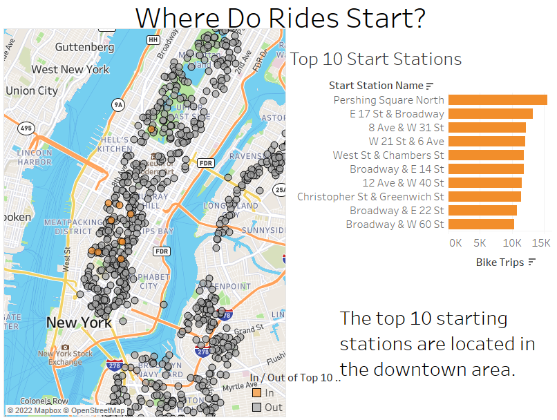
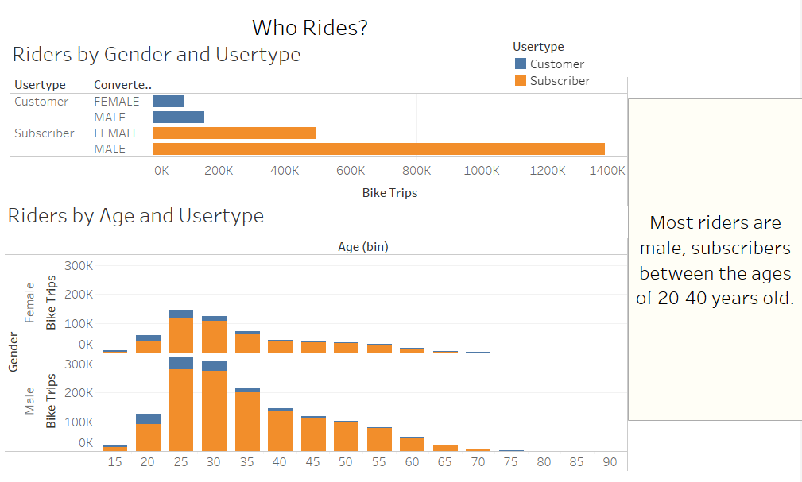
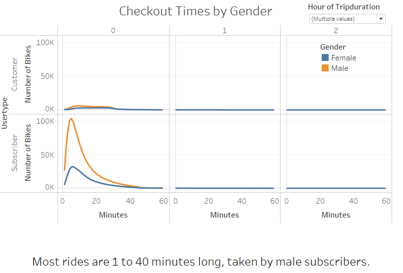

# bikesharing

[Link to Tableau Story](https://public.tableau.com/views/CitiBike_Challenge_16631907705010/CitibikeStory?:language=en-US&publish=yes&:display_count=n&:origin=viz_share_link)

## Overview

The purpose of this analysis is to see if Des Moines, Iowa would be good city to start a bike-sharing company.  The data collected came from New York City, where the bike sharing is already very popular.  The data is from August of 2019, and was filtered to only look at people who entered their gender (omitted any unknown gender entries) and people younger than 90 years old.  We did this to help identify which gender and age groups are more likely to use the bike sharing, without looking at misleading data, such as someone entering their birthdate wrong.  The hope is to take this data and show that Des Moines would be a great city to start this bike sharing company in.  

## The Results

### Who is using the bikes?

Bike sharing could be a great investment, especially in cities, since the majority of starting stations were located in the downtown area of New York City.  The majority of people using the bike sharing services were subscribers (at 88%), compared to customers (at 12%).  When we broke it down even further into gender, males were more likely to rent a bike than females.  When age is used to identify users, people between the ages of 20 and 40 years old are more likely to be riders.  

### When are the bikes being used the most?

Subscibers were more likely to use the bikes during the week day, during the hours of the morning commute (7:00-9:00am) and the afternoon commute (4:00-7:00pm).  The customers were more likely to use the bikes during the weekends, during the hours of 11:00am and 7:00 pm.  This could mean that tourist are using the bike sharing services to visit around the city, rather than walking or taking a cab.  

### What bikes are being used the most?

There are many bikes that are being used for over 300 trips during the month of August, with the majority of rides lasting between 1 and 40 minutes.  The bikes that are used the most, are all being used by subscribers.  These bikes may need to be serviced more often than other bikes, that are not used as often.  Bike ID 38124 has the most amount of rides, with a total of 445 trips.    

## Summary

In summary, the bike sharing is a very popular form of transportation in New York City, for people to get around the city.  This could be true in other cities, assuming this data is representative of all large cities.  If Des Moines, Iowa has a good size commuter population, in the city, and tourists visiting on the weekend, this could be a great opportunity for investment.  We would realy need to know more data on Des Moines, before we could see how successful this business would be.  If we had the data on how many people worked in the city at different locations, in New York City, that could better help us understand where starting stations might be more successful, since it seemed like most of the rides during the week were during commuting hours.  
It could also be helpful if some bikes were used in Des Moines, and then we could collect that data to use to see how successful the bike share is going.  If we started with a small sample of bikes, and track the data just like NYC, then we would be able to see over a few months if this is something that could work.  We would want to see where people are starting their bike rides from, how long they rode for, and how often the bikes are being used.  If the data was trending in a positive direction, then this would be something that could be expanded to include more bikes.  We would also need to look at weather.  Both NYC and Des Moisne have beautiful summers, but how often are the bikes being used in fall, winter and spring?  August is going to be a popular time for tourist in NYC, so this data on customers may be slightly misleading compared to other months.  We would also want to investigate newer data.  This data is from 2019, and there has been a lot of changes that happened in our world since then.  Is the data still showing the same success Pre-Covid and Post-Covid?  
Overall, this data looks like the ride sharing is a great investment for large cities, and could be a great investment opportunity in Des Moines.  
